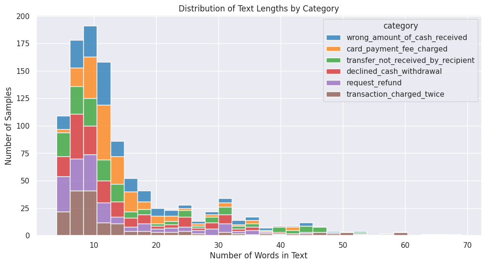
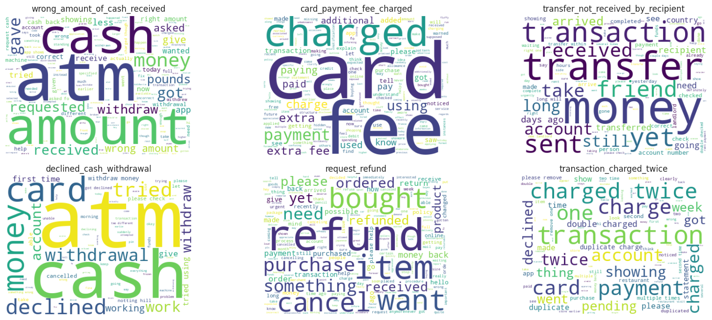
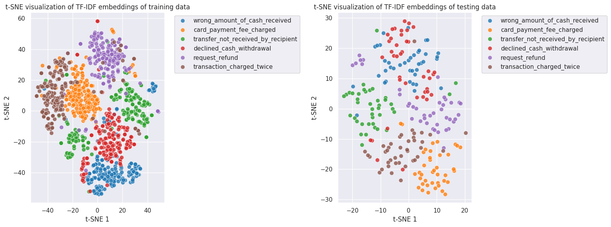
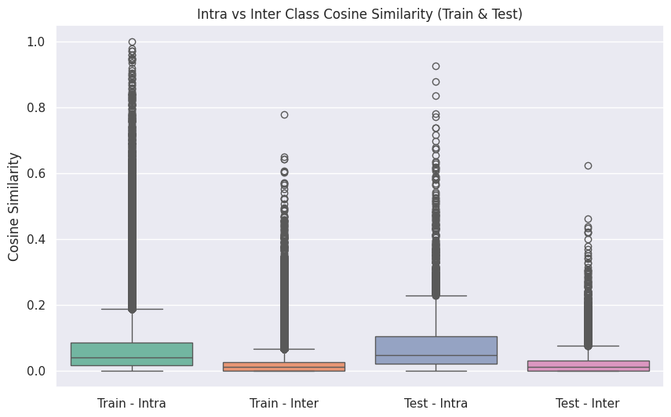
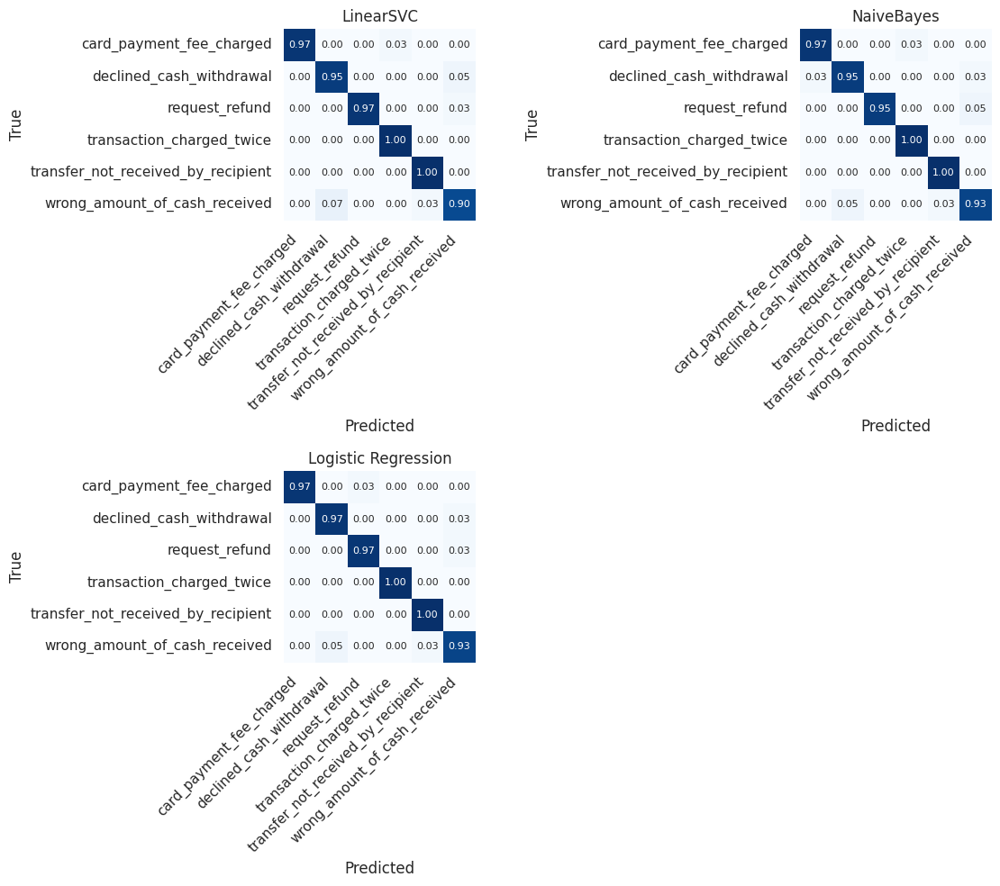
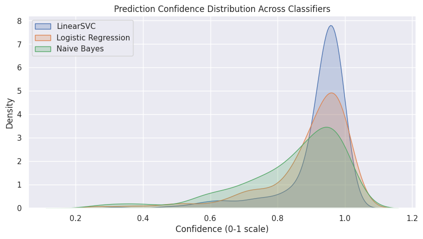

# Banking Intent Classification System 🏦🤖

[](https://www.python.org/)
[](https://fastapi.tiangolo.com/)
[](https://streamlit.io/)

## 🚀 Live Demo

🔗 **[Live Demo](https://p01--banking-intent-classification-system--hyf6vq9658q7.code.run/)** 
Interactive Streamlit UI for real-time and batch banking intent classification.


## 🎯 Problem Statement & Overview

Digital banking queries (e.g., *"check my balance"*, *"transfer money"*) are often short, noisy, and ambiguous, making automated support difficult. This **Banking Intent Classification system** solves this by formulating intent recognition as a **multi-class text classification problem**, mapping raw text to predefined categories for smarter automation. Built using classical NLP techniques, the system features a full ML lifecycle—from preprocessing to training—and is deployed via a **FastAPI backend** and an **interactive Streamlit app** for real-time testing and batch analysis.

The saved classification model identifies the following six banking intents:

* **Card Payment Fee Charged**: Queries regarding unexpected fees on card transactions.
* **Declined Cash Withdrawal**: Issues involving failed attempts to withdraw money from an ATM.
* **Request Refund**: Users seeking to get their money back for a specific transaction.
* **Transaction Charged Twice**: Reporting duplicate charges for a single purchase.
* **Transfer Not Received by Recipient**: Tracking sent funds that haven't reached the destination.
* **Wrong Amount of Cash Received**: Discrepancies between requested and received cash at an ATM.
---

## 🔄 End-to-End System Flow

```
User Query (via Streamlit UI)
   ↓
FastAPI REST Endpoint (/api/classify)
   ↓
Text Preprocessing
   ↓
TF-IDF Vectorization
   ↓
Logistic Regression Classifier
   ↓
Predicted Intent + Confidence Score
```
---

## 🧠 Experiment and Analysis steps

All experimentation and model development are documented in **experiments/training.ipynb**. The steps are as follows:

### 1️⃣ Text Preprocessing

We do preprocessing on raw banking queries that involve **lower-casing**, **removal of punctuation and special characters** followed by **token normalization** to reduce vocabulary noise while preserving semantic intent. For example:

| Before preprocessing | After preprocessing |
| :--- | :--- |
| Why did I only receive a partial amount of what I tried to withdraw? | why did i only receive a partial amount of what i tried to withdraw? |
| my atm transaction was wrong | my atm transaction was wrong |
| why did i only get 20.00 | why did i only get 20.00 |

---

### 2️⃣ Exploratory Data Analysis (EDA)

#### 📉 Text Length Distribution
We analyzed the word count distribution across all categories using histograms. We observe that **wrong_amount_of_cash_received** and **card_payment_fee_charged** consist of notably shorter queries compared to other intents, which often contain more descriptive language.



#### ☁️ Intent-Based Word Clouds
We generated intent-specific word clouds to visualize the prominent vocabulary for each category. This reveals that **declined_cash_withdrawal** and **wrong_amount_of_cash_received** share significant overlap in high-frequency terms like **"atm"** and **"cash"**, suggesting that these two classes may be more challenging for the model to differentiate accurately.



### 3️⃣ Feature Engineering — TF‑IDF

To transform raw text into numerical vectors, we utilize **TF-IDF (Term Frequency–Inverse Document Frequency)**. This lightweight approach captures the importance of words relative to specific intent classes, prevents common tokens from dominating the feature space, and produces a high-dimensional representation ideal for linear models.

#### 📍 t-SNE Visualization of Feature Space
By applying **t-SNE** to TF-IDF vectors and plotting them, we see clear clustering and separation between different intent classes, confirming that TF-IDF vectorization produces highly discriminative features for our classifier.



#### 📏 Intra- vs Inter-Class Cosine Similarity
Using **Cosine Similarity** analysis, we further prove in the boxplot below that intra-class similarity (similarity within the same intent) is significantly higher than inter-class similarity across both training and testing sets. This confirms that the vectorizer is extracting meaningful and consistent representations for each banking intent.



### 4️⃣ Model Training & Hyperparameter Tuning

We experimented with three linear classifiers—**Logistic Regression**, **Naive Bayes**, and **Support Vector Machine (SVM)**—using two distinct validation strategies to identify the most robust configuration.

#### 🧪 Validation Strategies
* **Train/Validation Split:** 20% of the training data was used as validation set. Both Logistic Regression and Linear SVM achieved high validation accuracy (~99%) in this setup.
* **3-Fold Cross-Validation:** K-Fold cross-validation was applied across the entire training dataset, providing a more reliable estimate of real-world performance.

#### 📊 Model Comparison Results
The table below summarizes the performance metrics across both validation strategies:

| Classifier | Accuracy | Precision | Recall | F1-Score | Validation Type |
| :--- | :--- | :--- | :--- | :--- | :--- |
| **Logistic Regression** | 0.9905 | 0.9907 | 0.9905 | 0.9905 | Train/Val Split |
| **Naive Bayes** | 0.9715 | 0.9719 | 0.9715 | 0.9716 | Train/Val Split |
| **Linear SVM** | 0.9905 | 0.9907 | 0.9905 | 0.9905 | Train/Val Split |
| **Logistic Regression** | 0.9696 | 0.9703 | 0.9696 | 0.9696 | 3-Fold CV |
| **Naive Bayes** | 0.9630 | 0.9636 | 0.9630 | 0.9629 | 3-Fold CV |
| **Linear SVM** | 0.9734 | 0.9743 | 0.9734 | 0.9734 | 3-Fold CV |

### 5️⃣ Model Evaluation & Selection

We stored the best performing models obtained in the validation phase and evaluated them on testing data. **Logistic Regression** emerged as the top-performing model, achieving a test accuracy of **97.5%**. 

| Model | Test Accuracy |
| :--- | :--- |
| **Logistic Regression** | **97.5%** |
| **Naive Bayes** | 96.6% |
| **Linear SVM** | 96.6% |

#### 🧩 Confusion Matrices
The confusion matrices confirm our earlier EDA findings: all classifiers occasionally struggle to distinguish between `wrong_amount_of_cash_received` and `declined_cash_withdrawal`. This semantic overlap remains the primary driver of misclassifications across all models.



---

### 6️⃣ Confidence & Error Deep-Dive

We conducted a dual analysis to evaluate the reliability of our model's predictions beyond simple accuracy metrics.

* **Confidence Analysis:** By plotting the maximum predicted probabilities, we found that **Linear SVM** produces the most "confident" predictions (density centered around 0.9), followed by Logistic Regression and Naive Bayes.
* **High-Confidence Misclassifications:** We isolated errors where the model was >70% confident but incorrect. The most common error was misidentifying `wrong_amount_of_cash_received` as `declined_cash_withdrawal`, reinforcing the need for more granular features in future iterations.



---

### 7️⃣ Ensemble Experimentation

In an attempt to further optimize performance, we implemented a **Majority Voting Ensemble** combining all three classifiers. 

| Approach | Test Accuracy |
| :--- | :--- |
| **Standalone Logistic Regression** | **97.5%** |
| **Ensemble (Voting)** | 97.0% |

**Conclusion:** The ensemble actually resulted in a slight performance dip compared to the standalone Logistic Regression model. Consequently, we opted for the simpler, more efficient **Logistic Regression** model for the final production deployment.

## 📌 Available Endpoints (`/api`)

#### `GET /api/health`
Lightweight health-check endpoint.

* Confirms that the API service is running
* Useful for deployment monitoring

---

#### `POST /api/classify`
Single-text intent classification endpoint.

* Accepts a single banking-related text query
* Applies preprocessing and TF-IDF vectorization
* Uses the trained Logistic Regression model to infer intent
* Returns the predicted intent label along with a confidence score

---

#### `POST /api/classify/batch`
Batch intent classification endpoint.

* Accepts multiple text queries in a single request
* Processes each query independently through the same NLP pipeline
* Returns intent predictions and confidence scores for each input

---

#### `GET /api/model/info` *(Protected)*
Model metadata and inspection endpoint.

* Requires HTTP Basic authentication
* Exposes model and vectorizer details:
  * Model type
  * Vectorizer type
  * Number of intent classes
  * List of supported intent labels

---

## 🐳 Docker Deployment

For a consistent and isolated environment, you can deploy the entire stack using **Docker**. This bundles the FastAPI backend, Streamlit frontend, and the trained model into a single containerized unit.

#### 1. Build the Image
Create the Docker image using the following command:

``` bash
docker build -t intent-app .
```

#### 2. Run the Container
Launch the container, mapping the internal port to your local machine (e.g., port 8080):

``` bash
# This command stops/removes any existing container with the same name before starting a new one
docker rm -f intent-container 2>/dev/null; docker run -p 8501:8501 --name intent-container intent-app
```

Once the container is running, the services will be accessible via the mapped port on your localhost.

---

## 🎯 Conclusion

This project demonstrates a production-ready approach to **Banking Intent Classification**. By combining classical NLP robustness (TF-IDF + Logistic Regression) with modern deployment stack (Streamlit + FastAPI + Docker), it provides a scalable solution for automating customer support queries.
